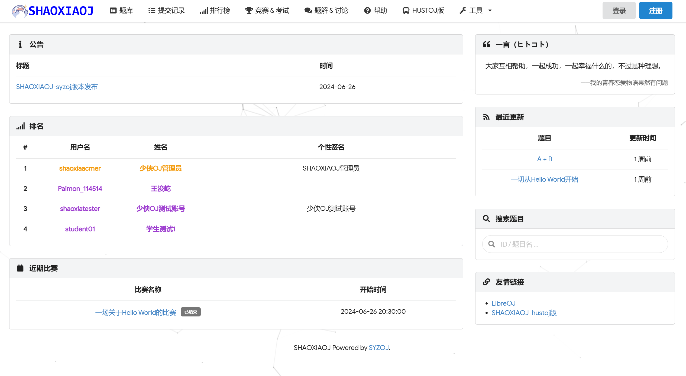

# SYZOJ的部署与二次开发详解
因为好多人喜欢Libre OJ的布局和功能，我就来浅谈一下SYZOJ如何部署安装以及二次开发。

### 序、主页展示


demo: [点此进入](http://loj.shaoxiaoj.top)。

### 一、准备工作
- 有属于自己的服务器（推荐阿里云服务器,内存2核2G以上）
- 知道 Linux 基础语法
- 安装 VS code 和 Filezilla
- 拥有一个域名

### 二、网站端部署
下面我以Ubuntu 20.04为例讲解 (官方文件就是以此系统为例,我的服务器也就用了这个系统)

# 生成随机密钥
以下命令可方便生成 20 个字符的随机密钥，为下面填写 ``session_secret`` 和 ``judge_token`` 做准备。

```` 
echo $(dd if=/dev/urandom | base64 -w0 | dd bs=1 count=20 2>/dev/null)
````

# 安装系统依赖项
 安装 Node.js 16、Yarn 1、MariaDB 10.3 与 Redis 5 等工具：
````
apt update
apt install curl
apt install pnupg2
curl -sS https://dl.yarnpkg.com/debian/pubkey.gpg | apt-key add -
curl -fsSL https://deb.nodesource.com/setup_current.x | bash -
echo "deb https://dl.yarnpkg.com/debian/ stable main" | tee /etc/apt/sources.list.d/yarn.list
apt-key adv --recv-keys --keyserver hkp://keyserver.ubuntu.com:80 0xF1656F24C74CD1D8
apt install -y software-properties-common
add-apt-repository 'deb [arch=amd64,arm64,ppc64el] http://mirrors.tuna.tsinghua.edu.cn/mariadb/repo/10.3/ubuntu focal main'
add-apt-repository ppa:chris-lea/redis-server # Ubuntu 20.04 不需要执行这条
apt update
apt install -y git mariadb-server redis-server nodejs yarn p7zip-full clang-format
apt install -y nginx
````

# 下载
创建存放 SYZOJ 程序的目录并下载安装 SYZOJ。
````
rm -rf /opt/syzoj /etc/systemd/system/syzoj*
mkdir -p /opt/syzoj
cd /opt/syzoj
git clone https://bgithub.xyz/syzoj/syzoj web
cd web
yarn
````

如果 `` yarn `` 无法识别，可在浏览器上搜索其安装方法。最主要的方法是通过 ``npm`` 进行安装。
````
npm install -g yarn
````

如果 `` npm `` 无法识别，可在浏览器上搜索其安装方法。以下是我在浏览器上找的方法：
````
ln -s /usr/local/nodejs/nodejs10/bin/npm /usr/bin/npm
npm -v        //检查npm是否配置成功
npm install -g cnpm --registry=https://registry.npm.taobao.org
ln -s /usr/local/nodejs/nodejs10/bin/cnpm /usr/bin/cnpm
cnpm -v       //查看版本
````

# 配置
从配置文件模板创建用于 SYZOJ 网站端的配置文件。
````
mkdir -p /opt/syzoj/config
cp /opt/syzoj/web/config-example.json /opt/syzoj/config/web.json
ln -s ../config/web.json /opt/syzoj/web/config.json
````

编辑 ``/opt/syzoj/web/config.json`` ，如下是您可能需要修改的一些配置项。其中名称加粗的配置项是您很有可能需要修改的。
````
sudo vim /opt/syzoj/web/config.json      //使用nano亦可
````

以下是必须要修改的内容：

``title``：网站的标题。显示在网站每个页面的左上角与标题栏中。
``password``：为安全起见，请使用随机密钥填写。
``session_secret``：为安全起见，请使用随机密钥填写。
``judge_token``：为安全起见，请使用随机密钥填写。

创建独立的目录用于存放数据和临时文件，这将便于您对网站的维护：
````
mv /opt/syzoj/web/uploads /opt/syzoj/data
ln -s ../data /opt/syzoj/web/uploads
mkdir /opt/syzoj/sessions
ln -s ../sessions /opt/syzoj/web/sessions
````

# 创建账户
为安全起见，我们不推荐在生产环境中使用 ``root`` 账户运行 ``SYZOJ`` 网站端。建议为 ``SYZOJ`` 单独创建一个用户运行，该用户必须能够写入 ``sessions`` 和 ``data（uploads）``文件夹

````
adduser --disabled-password --gecos "" syzoj # 以用户名 syzoj 为例
chown -R syzoj:syzoj /opt/syzoj/data /opt/syzoj/sessions /opt/syzoj/config/web.json
````

# 创建数据库
执行以下命令进入mysql
````
mysql
````

如果 ``mysql`` 无法识别，可在浏览器上查询安装的方法。以下是我查询到的：
````
wget -i -c http://dev.mysql.com/get/mysql57-community-release-el7-10.noarch.rpm
yum -y install mysql57-community-release-el7-10.noarch.rpm
yum -y install mysql-community-server
yum module disable mysql        //此条语句在提示Unable to find a match: mysql-community-server后使用。一般来说不用执行此步骤
systemctl start mysqld.service
````

如果 ``yum`` 无法识别，可在浏览器上查询安装的方法。以下是我查询到的：
````
apt-get install build-essential
apt-get install yum
````

创建数据库以及 SYZOJ 网站端连接数据库所使用的用户。
````
CREATE DATABASE `syzoj` DEFAULT CHARACTER SET utf8mb4 COLLATE utf8mb4_unicode_ci;
GRANT ALL PRIVILEGES ON `syzoj`.* TO "syzoj"@"localhost" IDENTIFIED BY "<FILLYOURPASSWORDHERE>";
    //别忘了修改<FILLYOURPASSWORDHERE>为你刚刚设定的password值
FLUSH PRIVILEGES;
````

# 运行
执行以下命令以在前台以调试模式运行 SYZOJ，可用于收集错误信息：
````
cd /opt/syzoj/web && node app.js
````

# 使用 systemd

创建并修改 ``/etc/systemd/system/syzoj-web.service`` 文件
````
touch /etc/systemd/system/syzoj-web.service
sudo vim /etc/systemd/system/syzoj-web.service
````

填写以下内容：

````
[Unit]
Description=SYZOJ web service
After=network.target mysql.service rc-local.service
Requires=mysql.service rc-local.service

[Service]
Type=simple
WorkingDirectory=/opt/syzoj/web
User=syzoj
Group=syzoj
ExecStart=/usr/bin/env NODE_ENV=production /usr/bin/node /opt/syzoj/web/app.js -c /opt/syzoj/config/web.json
RemainAfterExit=yes

[Install]
WantedBy=multi-user.target
````

执行以下命令启用SYZOJ网站端，并将其设置为开机启动。
````
systemctl start syzoj-web        //此命令也是二次开发改动刷新的命令之一
systemctl enable syzoj-web
````

# 使用 Nginx
创建并修改 ``/etc/nginx/sites-enabled/syzoj`` 文件
````
touch /etc/nginx/sites-enabled/syzoj
sudo vim /etc/nginx/sites-enabled/syzoj
````

填写以下内容：
````
map $http_upgrade $connection_upgrade {
    default upgrade;
    '' close;
}

server {
    listen 80;
    listen [::]:80;
    
    server_name syzoj.example.com;      //修改为你的域名

    location / {
        proxy_http_version 1.1;
        proxy_set_header X-Forwarded-For $proxy_add_x_forwarded_for;
        proxy_set_header X-Forwarded-Proto $scheme;
        proxy_set_header X-Real-IP $remote_addr;
        proxy_set_header Upgrade $http_upgrade;
        proxy_set_header Host $host;
        proxy_set_header Connection $connection_upgrade;
        proxy_pass http://127.0.0.1:5283;
    }
}
````

然后刷新 ``nginx`` 。
````
systemctl reload nginx
````

不出意外的话，访问你的域名就能正常进入SYZOJ网页端了。

# 管理全站管理员
注册第一个账号，系统会识别此用户的ID值为1。赋予全站管理员权限。
````
UPDATE `syzoj`.`user` SET `is_admin` = 1 WHERE `id` = 1;
````

全站管理员是 SYZOJ 中权限最高的一类用户。由于安全起见，SYZOJ 网页端无法修改全站管理员，必须通过数据库修改。
授予 ID 为 1 的用户全站管理员权限（其中 `syzoj` 为数据库名，下同）：
````
UPDATE `syzoj`.`user` SET `is_admin` = 1 WHERE `id` = 1;
````

取消 ID 为 1 的用户全站管理员权限：
````
UPDATE `syzoj`.`user` SET `is_admin` = 0 WHERE `id` = 1;
````

授予用户名为 Menci 的用户全站管理员权限：
````
UPDATE `syzoj`.`user` SET `is_admin` = 1 WHERE `username` = 'Menci';
````

取消用户名为 Menci 的用户全站管理员权限：
````
UPDATE `syzoj`.`user` SET `is_admin` = 0 WHERE `username` = 'Menci';
````

修改后请重启网站端。
````
systemctl stop syzoj-web
systemctl start syzoj-web
````

### 三、部署评测端
# 准备沙箱
SYZOJ 的评测全部在沙箱中进行。其沙箱实现基于 Linux 内核中一些不默认开启的特性，您需要在引导器中添加一些参数来开启这些特性，以 Ubuntu 的默认引导器 GRUB 2 为例，编辑 
 ``/etc/default/grub`` 。
````
sudo vim /etc/default/grub
````

将其中的 ``GRUB_CMDLINE_LINUX_DEFAULT="quiet splash"`` 后面加上 ``cgroup_enable=memory swapaccount=1 systemd.unified_cgroup_hierarchy=0 syscall.x32=y``。即

````
GRUB_CMDLINE_LINUX_DEFAULT="quiet splash cgroup_enable=memory swapaccount=1 systemd.unified_cgroup_hierarchy=0 syscall.x32=y"
````

运行以下命令更新 GRUB 2 的配置，然后重新启动。
````
update-grub && reboot
````

官方提供的沙箱根文件系统基于 Ubuntu 18.04，默认提供对 SYZOJ 网站端中所列的编程语言的评测支持。因为下载沙箱根文件系统所需的时间可能较长，我们把它放到第一步 —— 在下载的过程中，您可以进行其他步骤。
````
wget -O /sandbox-rootfs.tar.xz https://bgithub.xyz/syzoj/sandbox-rootfs/releases/download/210521/sandbox-rootfs-210521.tar.xz
````

建议在下载后检验文件的 MD5 值，如果您的下载无误，输出应为 ``882b3de905107f5116b227c90c4b8857`` 。
````
md5sum /sandbox-rootfs.tar.xz
````

将下载好的沙箱根文件系统解压。
````
mkdir -p /opt/syzoj/sandbox/rootfs
cd /opt/syzoj/sandbox/
tar xvf /sandbox-rootfs.tar.xz
````

建立一些沙箱需要使用的文件夹。
````
mkdir -p /opt/syzoj/sandbox/{bin,tmp1}
````

# 安装系统依赖项
SYZOJ 评测端需要 Node.js 10，并且包含一些依赖 Boost 库的 C++ 代码，你需要安装基本的编译环境``（build-essential）``和 ``Boost`` 库 ``libboost-all-dev``。依赖的服务有 ``redis-server`` 和 ``rabbitmq-server``。

首先，安装 C++ 编译环境和 Boost 库。
````
apt install build-essential libboost-all-dev
````
SYZOJ评测依赖 Redis 和 RabbitMQ。
````
apt install rabbitmq-server redis-server
````

# 准备 Node.js 10
使用以下命令下载 Node.js 10 并解压：
````
mkdir -p /opt/syzoj
wget -O /tmp/node-v10.24.1-linux-x64.tar.xz https://nodejs.org/dist/latest-v10.x/node-v10.24.1-linux-x64.tar.xz
tar xf /tmp/node-v10.24.1-linux-x64.tar.xz -C /tmp
mv /tmp/node-v10.24.1-linux-x64 /opt/syzoj/node10
# 如果没有部署过网站端，则安装 yarn。如果下面的步骤出现了yarn报错，则建议你执行这条语句重装一遍。
PATH=/opt/syzoj/node10/bin:$PATH /opt/syzoj/node10/bin/npm install yarn -g
````

# 下载
使用以下命令创建存放 SYZOJ 评测端程序的目录并从 GitHub 下载 SYZOJ 评测端。
````
cd /opt/syzoj
git clone https://bgithub.xyz/syzoj/judge-v3
mv judge-v3 judge
cd judge
PATH=/opt/syzoj/node10/bin:$PATH yarn
PATH=/opt/syzoj/node10/bin:$PATH yarn build
````

# 配置
使用以下命令创建用于 SYZOJ 评测端的配置文件。
````
cd /opt/syzoj
cp judge/daemon-config-example.json config/daemon.json
cp judge/runner-shared-config-example.json config/runner-shared.json
cp judge/runner-instance-config-example.json config/runner-instance.json
````

# 使用 systemd
编辑 ``/etc/systemd/syzoj/syzoj-judge-daemon.service`` 文件。
````
sudo vim /etc/systemd/syzoj/syzoj-judge-daemon.service
````

填入以下内容。
````
[Unit]
Description=SYZOJ judge daemon service
After=network.target rabbitmq-server.service redis-server.service
Requires=rabbitmq-server.service redis-server.service

[Service]
Type=simple
WorkingDirectory=/opt/syzoj/judge
User=syzoj
Group=syzoj
ExecStart=/opt/syzoj/node10/bin/node /opt/syzoj/judge/lib/daemon/index.js -c /opt/syzoj/config/daemon.json

[Install]
WantedBy=multi-user.target
````

编辑 ``/etc/systemd/syzoj/syzoj-judge-runner.service`` 文件。
````
sudo vim /etc/systemd/syzoj/syzoj-judge-runner.service
````

填入以下内容。
````
[Unit]
Description=SYZOJ judge runner service
After=network.target rabbitmq-server.service redis-server.service
Requires=rabbitmq-server.service redis-server.service

[Service]
Type=simple
WorkingDirectory=/opt/syzoj/judge
User=root
Group=root
ExecStart=/opt/syzoj/node10/bin/node /opt/syzoj/judge/lib/runner/index.js -s /opt/syzoj/config/runner-shared.json -i /opt/syzoj/config/runner-instance.json

[Install]
WantedBy=multi-user.target
````

执行以下命令开启判题端，并设置为开机启动。
````
systemctl start syzoj-judge-daemon
systemctl start syzoj-judge-runner
systemctl enable syzoj-judge-daemon
systemctl enable syzoj-judge-runner
````

至此，SYZOJ的搭建已经全部完成。

### 四、二次开发
本OJ文件与前端有关的代码都是 ``ejs`` 文件格式书写，需要您掌握vue相关技巧去修改。
前端代码路径：``/opt/syzoj/web/views``

其中的文件名都是英文名称，翻译成中文即可知道该文件的作用。你可以直接sudo vim修改，也可以通过Filezilla修改。
